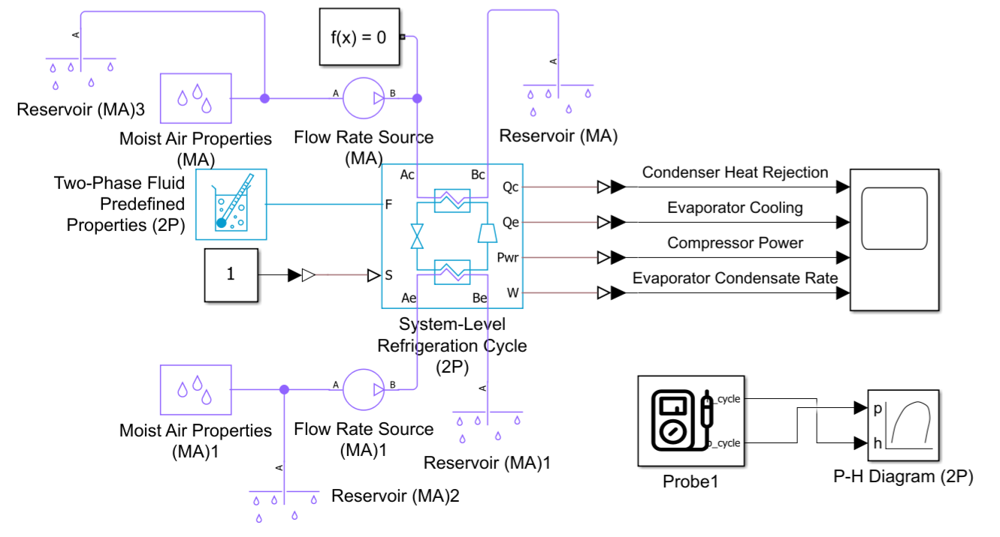
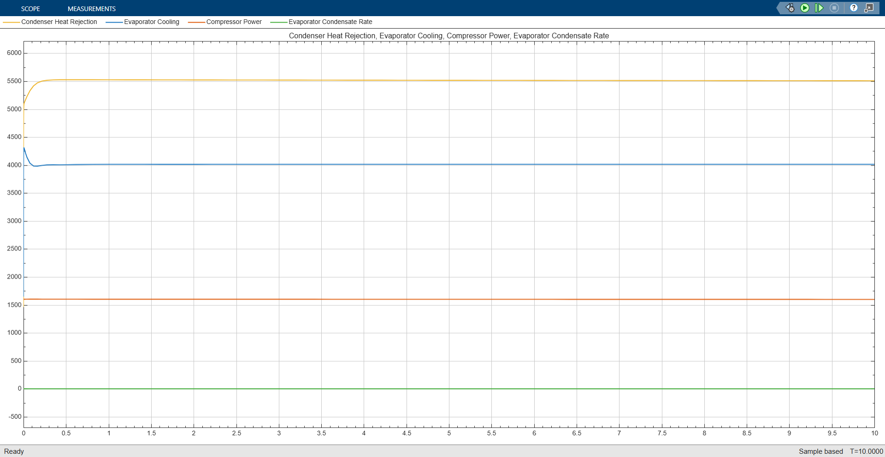
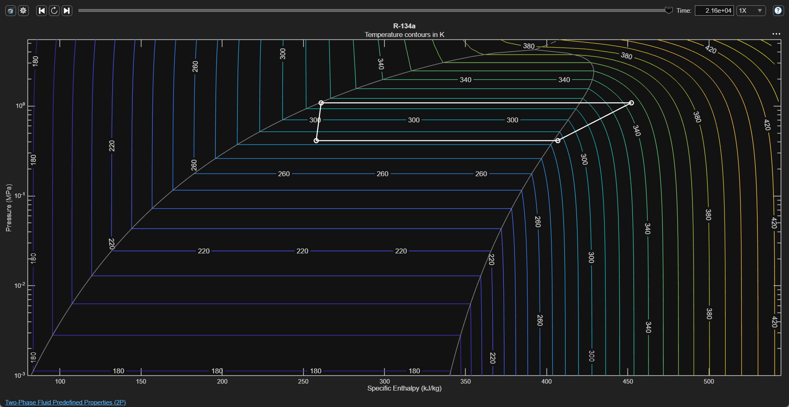

# Vapor-Compression Refrigeration Cycle
A vapor-compression refrigeration cycle was developed in MATLAB/Simulink using Simscape Fluids. R-134a was selected as the refrigerant for the initial prototype model. The refrigeration system consists of a compressor, condenser, expansion valve, and evaporator, with moist air used as the external fluid on the condenser and evaporator sides. The nominal evaporating and condensing temperatures were set to 5°C and 45°C respectively, with a nominal evaporator cooling capacity of 4 kW and compressor power of approximately 1.6 kW.

## Model Parameters
| Parameter | Value |
|---|---:|
| Refrigerant | R-134a |
| Cooling capacity (Qe) | 4 kW |
| Evaporating temperature | 5°C |
| Condensing temperature | 45°C |
| Evaporator air inlet | 12.5°C |
| Evaporator air RH | 92% |
| Condenser air inlet | 35°C |
| Nominal compressor power (Pcomp) | 1.6 kW |
| COP | 2.5 |
| Condenser heat rejection (Qc) | 5.6 kW |

## Results
The evaporator provided approximately 4 kW of cooling, while the compressor consumed approximately 1.6 kW of power. The condenser rejected approximately 5.6 kW of heat to the ambient side. The results satisfy the expected refrigeration energy balance, where condenser heat rejection is approximately equal to the sum of evaporator cooling and compressor power. The resulting coefficient of performance was approximately 2.5.

\[
Q_c=Q_e+P_{comp}
\]

\[
COP=\frac{Q_e}{P_{comp}}
\]

### Scope Output
1. Condenser heat rejection
2. Evaporator cooling
3. Compressor power
4. Evaporator condensate rate

### P-H diagram
The thermodynamic behavior of the R-134a refrigerant was visualized using a pressure-enthalpy (P-H) diagram. The diagram represents the four fundamental processes of the vapor-compression cycle: evaporation, compression, condensation, and expansion. The refrigerant undergoes heat absorption at low pressure in the evaporator, pressure and enthalpy increase during compression, heat rejection occurs at high pressure in the condenser, and the expansion valve reduces the refrigerant pressure before the refrigerant returns to the evaporator.

